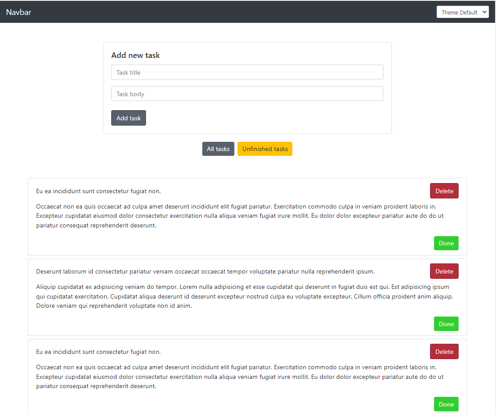

# To do list

Проект є додатком для управління списком справ, який дозволяє користувачам ефективно організовувати свої завдання та відстежувати їх виконання.
Користувачі можуть створювати нові завдання та додавати їх до списку справ. Завершені завдання можна легко видалити зі списку, щоб не перевантажувати його та зосередитись на поточних справах. Невиконані завдання можна окремо сортувати.

